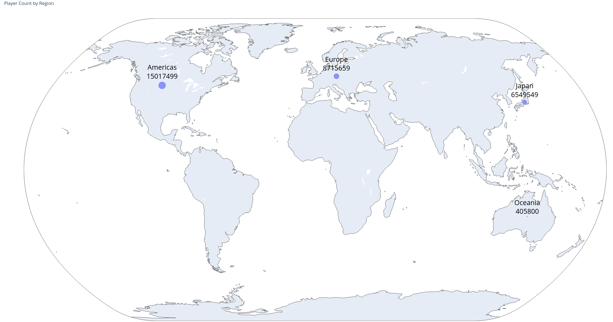
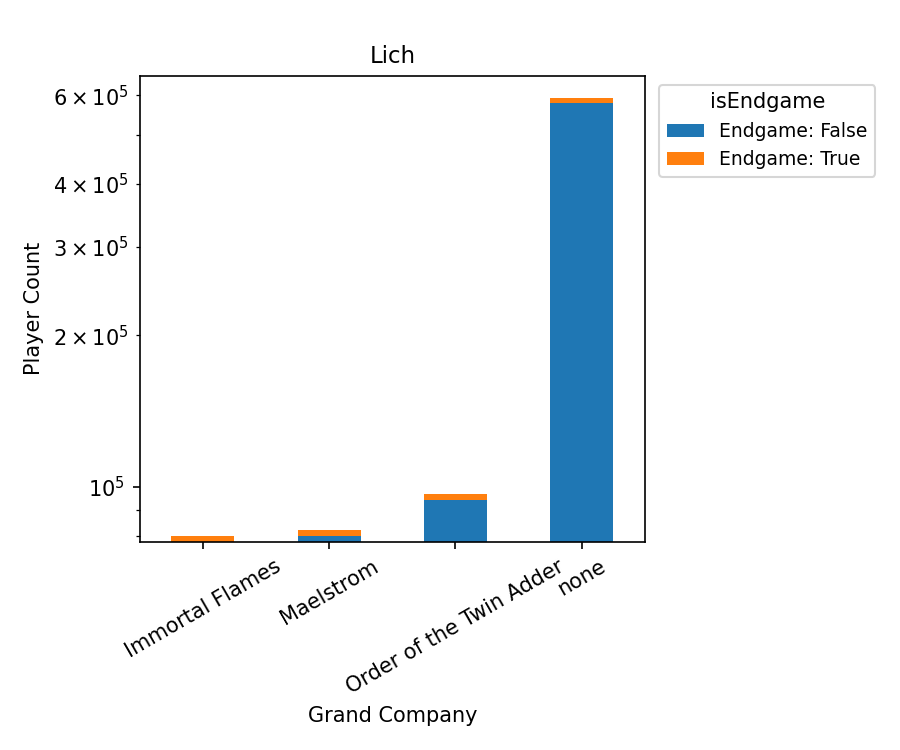
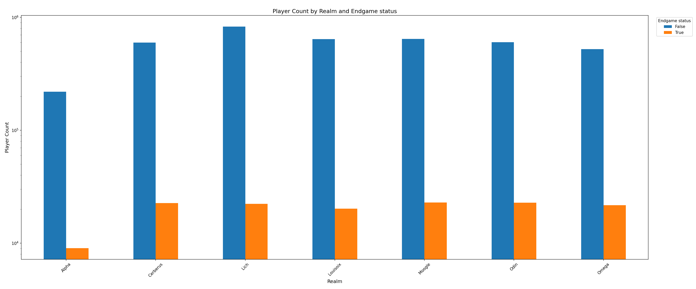
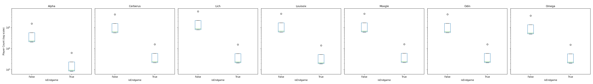
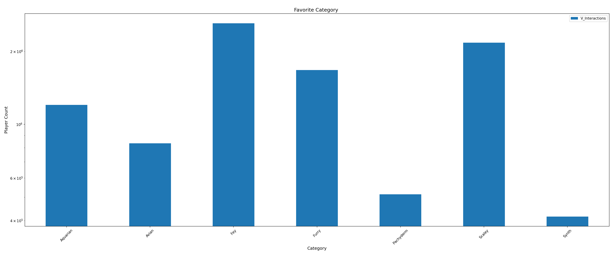
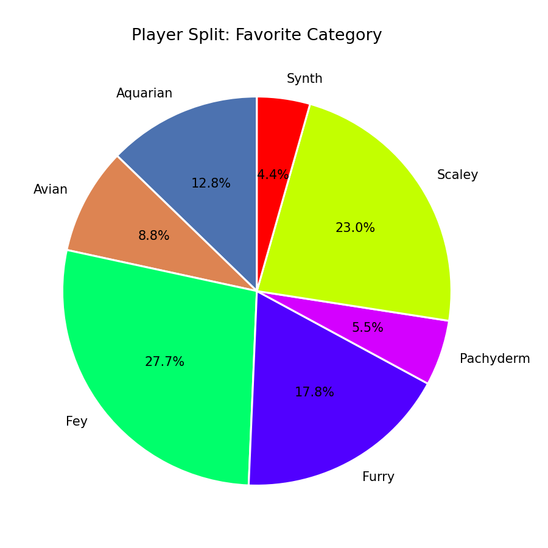

= DBI2526 - Summer Project
:sectnums:
:theme: ./theme.yml
:toclevels: 3
:toc: macro

== Idea & Research Questions

=== Idea
Analysis of player data from the MMORPG game Final Fantasy XIV: A Realm Reborn.

=== Research Questions

1) How are players distributed between grand companies on a specific realm? (slice) +
2) How many players are located on selected realms and are in the endgame? (dice) +
3) How many realms are located on european servers? (drill)

// Sources & Data
include::../data/Readme.adoc[]

== Enrichment Idea
=== Ridiculous Research Questions

1) Which Furry-Subcategory is most popular according to player data regarding the Tribes leveling mechanic?

== Cube Visualization
=== Facts
==== Fact
image::./media/cube/fact.png[]

==== Enriched Fact
image::./media/cube/enriched_fact.png[]

==== Ridicilous Fact
image::./media/cube/ridicilous_fact.png[]

=== Dimensions
==== Dim_isEndgame
image::./media/cube/dim_isEndgame.png[]

==== Dim_Realms
image::./media/cube/dim_realms.png[]

==== Dim_GrandCompany
image::./media/cube/dim_GrandCompany.png[]

==== Dim_Species
image::./media/cube/dim_species.png[]

==== Dim_Tribes
image::./media/cube/dim_tribes.png[]

=== Subdimensions
==== Sub_Regions
image::./media/cube/sub_regions.png[]

==== Sub_Sex
image::./media/cube/sub_sex.png[]

==== Sub_Tribe_Categories
image::./media/cube/sub_tribe_categories.png[]

== Ridicilous Dimensions
See Enrichment Dimensions in Data

== GeoData

GeoData is plotted according to total players per region.

== Report on Research Questions
=== Research Questions
==== Question 1
===== Discussion
====== Assumption
The assumtion was that all three companies should have roughtly equal amounts of players

====== Result
The vast majority is not part of any grand company, while the comapy "Order of the Twin Adder" is in second place with a significantly bigger playercount then the oder 2.

===== Plot
//insert Images of plots

==== Question 2
===== Discussion
====== Assumption
The proportion between endgame and general playeramount should be similar between all servers.

====== Result
It is for all servers except for the server "Alpha" which was a newlie opened server at the time, so a lower portion of endgame players was expected

===== Plot
//insert Images of plots

==== Question 3
===== Discussion
====== Result
There are 16 realms on european servers

=== Ridiculous Research Questions
==== Question 1
===== Discussion
====== Assumption
The assumption was that furry-tribes are the most popular kind of furry-category, since it is the most standard furry-category.

====== Result
The most popular category turned out to be fey's, closely followed by scalies

===== Plot

//insert Images of plots
