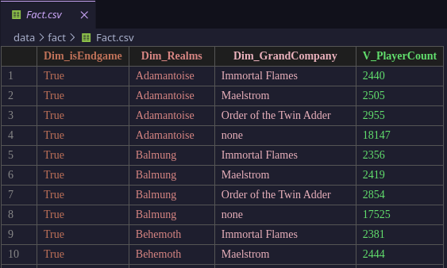
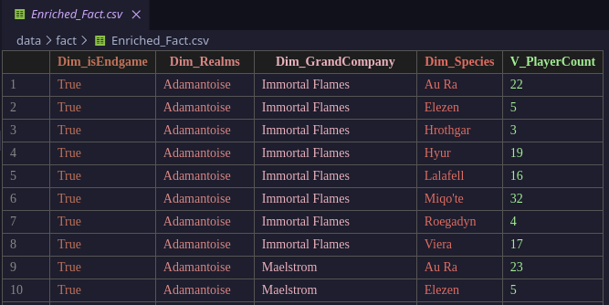
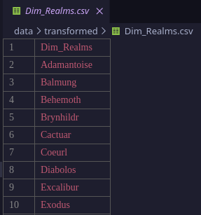
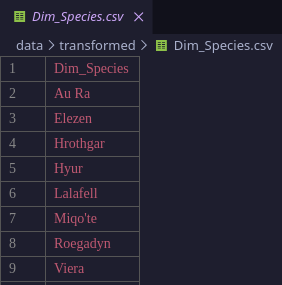
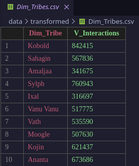
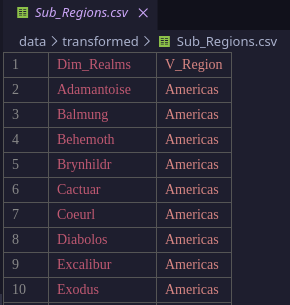
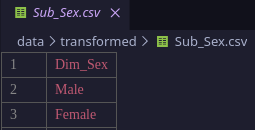
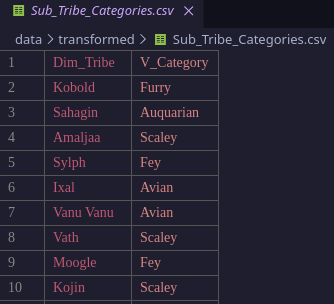

= DBI2526 - Summer Project
:sectnums:
:theme: ./theme.yml
:toclevels: 3
:toc: macro

== Idea & Research Questions

=== Idea
Analysis of player data from the MMORPG game Final Fantasy XIV: A Realm Reborn.

=== Research Questions

1) How are players distributed between grand companies on a specific realm? (slice)
2) How many players are located on selected realms and are in the endgame? (dice)
3) How many realms are located on european servers? (drill)

// Sources & Data
include::../data/Readme.adoc[]

== Enrichment Idea
=== Ridiculous Research Questions

1) Which Furry-Subcategory is most popular according to player data regarding the Tribes leveling mechanic?
2) Do players who play female characters play longer?

== Cube Visualization
=== Facts
==== Fact

==== Enriched Fact

==== Ridicilous Fact
image::./media/cube/ridicilous_fact.png[]

=== Dimensions
==== Dim_isEndgame
image::./media/cube/dim_isEndgame.png[]

==== Dim_Realms

==== Dim_GrandCompany
image::./media/cube/dim_GrandCompany.png[]

==== Dim_Species

==== Dim_Tribes

=== Subdimensions
==== Sub_Regions

==== Sub_Sex

==== Sub_Tribe_Categories

== Ridicilous Dimensions
See Enrichment Dimensions in Data

== GeoData
GeoData is plotted according to total players per region.

== Report on Research Questions
=== Research Questions
==== Question 1
===== Discussion
====== Assumption

====== Result

===== Plot
//insert Images of plots

==== Question 2
===== Discussion
====== Assumption

====== Result

===== Plot
//insert Images of plots

==== Question 3
===== Discussion
====== Assumption

====== Result

===== Plot
//insert Images of plots

=== Ridiculous Research Questions
==== Question 1
===== Discussion
====== Assumption
The assumption was that furry-tribes are the most popular kind of furry-category, since it is the most standard furry-category.

====== Result

===== Plot
//insert Images of plots

==== Question 2
===== Discussion
====== Assumption
The assumption was that female players play longer, since they enjoy the game more thoroughly due to appearing as female. +
Furthermore players enjoy benefits due to being treated better in the game when playing female characters.

====== Result

===== Plot
//insert Images of plots