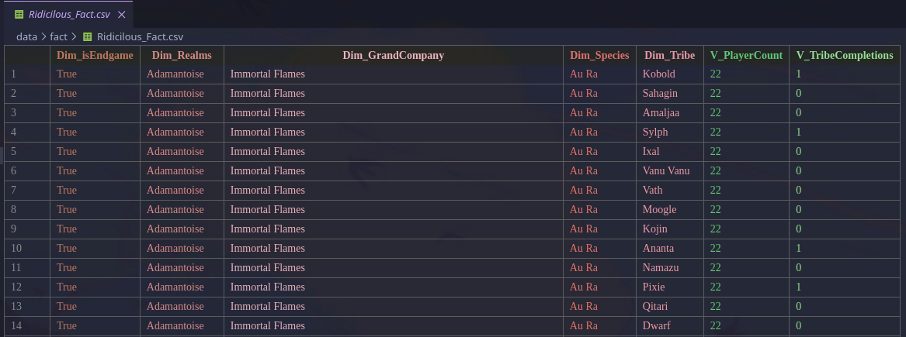
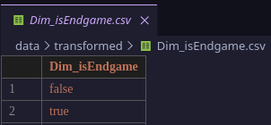
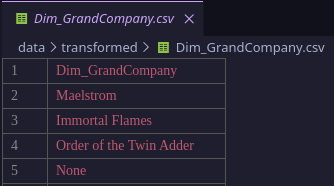

= DBI2526 - Summer Project
:sectnums:
:theme: ./theme.yml
:toclevels: 3
:toc: macro

== Idea & Research Questions

=== Idea
Analysis of player data from the MMORPG game Final Fantasy XIV: A Realm Reborn.

=== Research Questions

* Wie sind die Spieler auf die drei Grand Companies auf einem spezifischen Server verteilt?
* Wie viele Spieler sind auf einem spezifischen Server und im Endgame.
* Wie welche Realms gehören zu europäischen Servern?

// Sources & Data
include::../data/Readme.adoc[]

== Enrichment Idea
=== Ridiculous Research Questions

* Which Furry-Subcategory is most popular according to player data regarding the Tribes leveling mechanic. (drill)
* 

== Cube Visualization
=== Facts
==== Fact
image::./media/fact.png[]

==== Enriched Fact
image::./media/enriched_fact.png[]

==== Ridicilous Fact

=== Dimensions
==== Dim_isEndgame

==== Dim_Realms
image::./media/dim_realms.png[]

==== Dim_GrandCompany

==== Dim_Species
image::./media/dim_species.png[]

==== Dim_Tribes
image::./media/dim_tribes.png[]

=== Subdimensions
==== Sub_Regions
image::./media/sub_regions.png[]

==== Sub_Sex
image::./media/sub_sex.png[]

==== Sub_Tribe_Categories
image::./media/sub_tribe_categories.png[]

== Ridicilous Dimensions

== Report on Research Questions

